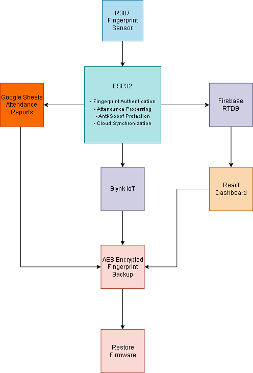
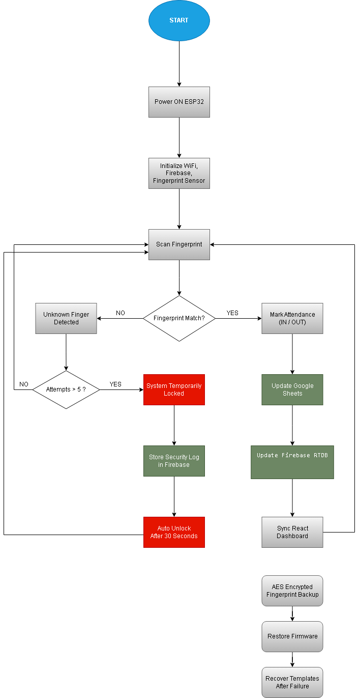
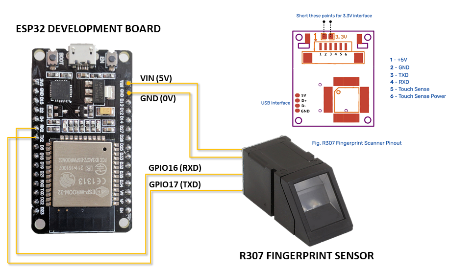
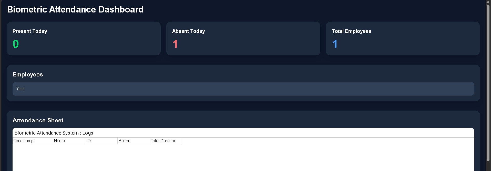
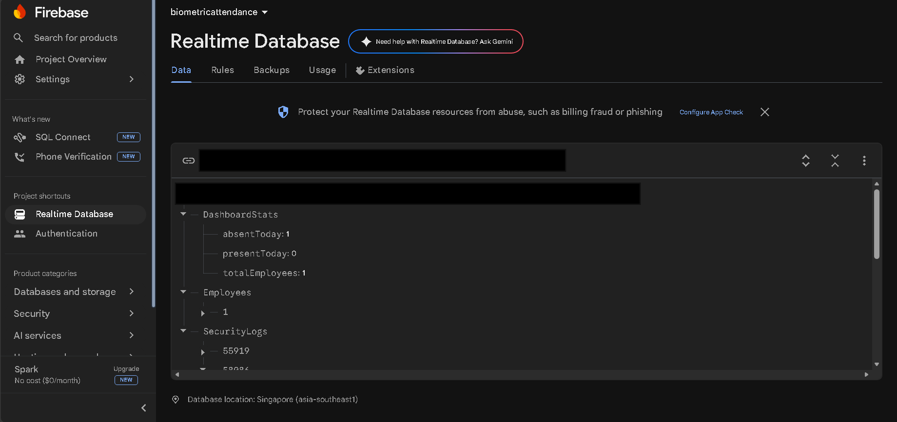
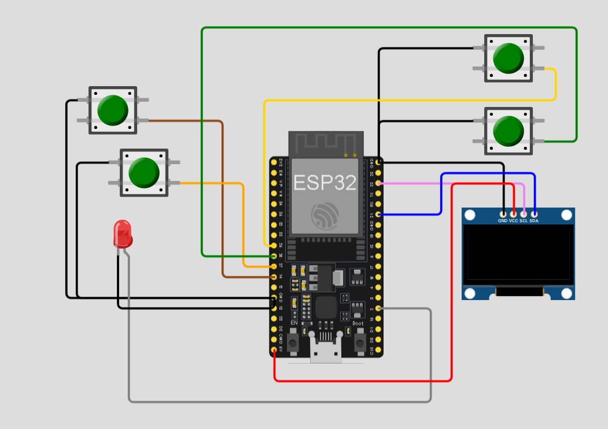

# Smart Biometric Attendance System

A cloud-connected biometric attendance system using ESP32 and R307 fingerprint sensor with Firebase, Google Sheets, React Dashboard, AES encrypted backup and disaster recovery support.

---

# Features

- Fingerprint-based attendance system
- ESP32 WiFi connectivity
- Firebase Realtime Database integration
- Google Sheets attendance logging
- React Admin Dashboard
- Blynk IoT integration
- AES encrypted fingerprint backup
- Restore firmware for disaster recovery
- Anti-spoof protection system
- Real-time dashboard synchronization
- Wokwi online simulation
- Firebase Hosting deployment

---

# Hardware Used

- ESP32 Development Board
- R307S Fingerprint Sensor

---

# Software Stack

- Arduino IDE
- Firebase RTDB
- Google Apps Script
- React.js
- Firebase Hosting
- Blynk IoT
- Wokwi Simulator

---

# System Architecture

## Block Diagram



---

## Flowchart



---

## Circuit Diagram



---

# Dashboard

## React Admin Dashboard



Features:
- Real-time attendance statistics
- Embedded Google Sheets attendance view
- Firebase synchronization
- Live employee monitoring

---

# Firebase Structure



Includes:
- Employees
- DashboardStats
- SecurityLogs
- AES encrypted fingerprint templates

---

# Wokwi Simulation



Simulation Link:

https://wokwi.com/projects/463603721061851137

---

# Project Workflow

1. User scans fingerprint
2. ESP32 authenticates fingerprint
3. Attendance marked IN/OUT
4. Google Sheets updated
5. Firebase RTDB synchronized
6. React Dashboard updated
7. AES encrypted fingerprint backup stored
8. Restore firmware recovers templates during sensor failure

---

# Security Features

- Anti-spoof detection
- Temporary lock after repeated invalid attempts
- AES encrypted template backup
- Disaster recovery support
- Firebase security logs

---

# Repository Structure

```text
Smart-Biometric-Attendance-System
│
├── Main_Firmware
├── Restore_Firmware
├── React_Dashboard
├── Google_Apps_Script
├── Wokwi_Simulation
├── Documentation
├── README.md
└── .gitignore
```

---

# Setup Instructions

## Clone Repository

```bash
git clone https://github.com/YOUR_USERNAME/smart-biometric-attendance-system.git
```

---

## React Dashboard Setup

```bash
cd React_Dashboard/biometric-dashboard
npm install
npm run dev
```

---

## Firebase Hosting

```bash
firebase deploy
```

---

# Future Scope

- Face recognition integration
- Mobile application support
- GPS-based attendance
- AI anomaly detection
- Multi-device synchronization
- Edge AI spoof detection

---

# Author

Yash Baid

---

# License

MIT License